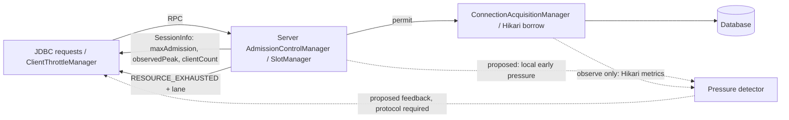

# Reactive Client Throttling: Connection Acquisition Pressure Analysis

## 1. Executive Summary

**Recommendation: do not use Hikari connection-acquisition p95 or Hikari pending threads as the primary early trigger.** OJP already queues requests *before* Hikari at an always-on admission semaphore and checks for a full Hikari pool before borrowing. The proposed sequence, in which Hikari borrow latency and pending threads reliably rise before request timeouts, is therefore **not established in this architecture**. A more promising early signal is persistent **fast-lane admission-slot wait/queue pressure**, confirmed by exhausted permits and useful work completing. First instrument both gates and test with Stressar; only then consider feeding an early-pressure state into the **existing** reactive controller. Preserve existing timeout handling.

Confidence: **high** that Hikari-only signals miss the main queue (confirmed by the acquisition and admission paths); **medium** that admission pressure yields enough useful lead time (requires load tests). This is an analysis/design proposal, not an implementation or a claim of benchmark results.

## 2. Existing Throttling Architecture

The JDBC driver's `Connection` holds a JVM-wide `THROTTLE_MANAGERS` map keyed by `connHash`; `setSession()` updates the associated `ClientThrottleManager` when a response carries throttle data ([Connection.java](../../ojp-jdbc-driver/src/main/java/org/openjproxy/jdbc/Connection.java#L52-L103)). Its modes are `OFF`, `PROACTIVE`, `REACTIVE` (default), and `COMBINED` ([ClientThrottleMode.java](../../ojp-jdbc-driver/src/main/java/org/openjproxy/jdbc/ClientThrottleMode.java)); the configured property is `ojp.jdbc.clientThrottle.mode` ([JDBC configuration](../configuration/ojp-jdbc-configuration.md)). The common `tryAcquire()` counter rejects locally rather than waiting, bypassing the limit in a transaction; `COMBINED` uses the smaller limit ([ClientThrottleManager.java](../../ojp-jdbc-driver/src/main/java/org/openjproxy/jdbc/ClientThrottleManager.java#L216-L315)). This counter measures in-flight **client requests**, not borrowed database connections.

Proactive mode derives a fair share from `maxAdmission`, per-node `clientCount`, the number of UP servers in `clusterHealth`, and a 0.9 margin. Reactive mode uses the same formula with `observedPeak` in place of `maxAdmission`. A smaller new calculated limit applies immediately; an increase is step-limited to +1 per update ([ClientThrottleManager.java](../../ojp-jdbc-driver/src/main/java/org/openjproxy/jdbc/ClientThrottleManager.java#L126-L197)). Proactive is an existing mode, not the name for the proposed early reactive signal.

Solid arrows are existing paths; dotted arrows are proposed. No cluster-wide pressure bus or existing per-request pressure field is implied.

## 3. Current Reactive Throttling Behavior

There are **two coupled increase/decrease loops**, not a single generic MDAI knob:

* Server `SlotManager.recordAdmissionTimeout()` reduces `observedPeak` to no more than the currently active slot count, subject to a 10% floor. Each `2 * totalSlots` releases can restore +1 ([SlotManager.java](../../ojp-server/src/main/java/org/openjproxy/grpc/server/SlotManager.java#L297-L313)). It does **not** update on a queue-depth rejection.
* Client `ClientThrottleManager.notifyServerOverload()` reduces `reactiveLimit` by a configurable factor (default **0.75**, not necessarily halving), subject to a floor of roughly `proactiveLimit / 4`; a 200 ms default cooldown coalesces bursts. Successful releases add +1 after a configurable count (default `max(8, reactiveLimit)`), up to `proactiveLimit` ([ClientThrottleManager.java](../../ojp-jdbc-driver/src/main/java/org/openjproxy/jdbc/ClientThrottleManager.java#L49-L96), [recovery](../../ojp-jdbc-driver/src/main/java/org/openjproxy/jdbc/ClientThrottleManager.java#L254-L303), [decrease](../../ojp-jdbc-driver/src/main/java/org/openjproxy/jdbc/ClientThrottleManager.java#L375-L441)).
* Fast/unknown `RESOURCE_EXHAUSTED` lane trailers trigger that client decrease; slow-lane and queue-depth signals do **not**, to avoid penalizing fast traffic for isolated slow work or a brief burst ([GrpcExceptionHandler.java](../../ojp-server/src/main/java/org/openjproxy/grpc/server/GrpcExceptionHandler.java#L92-L99), [ClientThrottleManager.java](../../ojp-jdbc-driver/src/main/java/org/openjproxy/jdbc/ClientThrottleManager.java#L321-L372)). Client-side limit rejection is a local `SQLTransientConnectionException`, not server feedback ([Statement.java](../../ojp-jdbc-driver/src/main/java/org/openjproxy/jdbc/Statement.java#L90-L99)).
* Server `SessionInfoUtils.stampThrottle()` writes live `maxAdmission`, `observedPeak`, `clientCount` when an admission manager exists; `Connection.setSession()` consumes them. Zero-valued throttle fields are ignored ([SessionInfoUtils.java](../../ojp-server/src/main/java/org/openjproxy/grpc/server/utils/SessionInfoUtils.java#L34-L86), [ClientThrottleManager.java](../../ojp-jdbc-driver/src/main/java/org/openjproxy/jdbc/ClientThrottleManager.java#L126-L141)). Updates depend on responses that carry and consume enriched `SessionInfo`, not a periodic push.

The existing timeout response is already a useful late signal, but a waiting operation can accrue latency long before its slot wait times out. Equally, a high count of **client** limit rejections is not evidence that Hikari is waiting.

## 4. Problem Statement

Can early, sustained local capacity pressure suppress growth or gently reduce the existing reactive client limit **before** admission timeouts, without unnecessary client rejections, throughput loss, or cross-pool contamination? The relevant queue may be the server's **admission semaphore**, not the connection pool itself. A leading signal must be measurable, correctly attributed, delivered to the right clients, and stable under recovery.

## 5. Connection Acquisition Pressure Hypothesis

The proposed measurement `nanoTime()` around `dataSource.getConnection()` captures elapsed *pool borrow* time, including obtaining an idle connection and potentially validation or connection creation, not specifically time waiting for an available pool slot. It excludes any earlier admission wait. It is not the duration of physical JDBC connection creation alone.

**Hypothesis to test, not assume:** Hikari utilization → Hikari borrow p95 → Hikari pending → request p95 → timeouts → throughput decline. In the current design a more plausible order is admission active-slot saturation → **admission waiters / wait p95** → request p95 → admission timeout, while Hikari pending and borrow latency stay near zero. Hikari pre-check failures or a resizing race can still expose real downstream pool contention. Ordering depends on sampling and workload; T1 and T2 can be simultaneous or reversed.

## 6. Existing Code Findings

| Confirmed behavior | Consequence for an early signal |
|---|---|
| `CreateSlowQuerySegregationManagerAction.execute()` creates an enabled `AdmissionControlManager` even with slow query segregation off; slots then run in admission-control-only mode ([source](../../ojp-server/src/main/java/org/openjproxy/grpc/server/action/connection/CreateSlowQuerySegregationManagerAction.java#L140-L155)). | Observe the gate before looking at Hikari. |
| `SlotManager.acquireFastSlot()`/`acquireSlowSlot()` try immediate access, possibly borrow from the other lane, cap semaphore queue depth, then wait up to a lane timeout; only a timed-out wait calls `recordAdmissionTimeout()` ([source](../../ojp-server/src/main/java/org/openjproxy/grpc/server/SlotManager.java#L112-L203)). | An early queue is visible inside `SlotManager`, but its length is not yet exposed as a dedicated time-series gauge. Queue-depth rejection is deliberately not treated as a normal reactive decrease. |
| `AdmissionControlManager.executeWithSegregation()` gates work; session creation can claim or acquire a session-scoped permit, while already pinned sessions can use monitoring-only execution ([source](../../ojp-server/src/main/java/org/openjproxy/grpc/server/AdmissionControlManager.java#L145-L215), [session permits](../../ojp-server/src/main/java/org/openjproxy/grpc/server/AdmissionControlManager.java#L219-L287)). | Long-held permits and transactions can cause a queue without rising Hikari borrow time. |
| `SessionConnectionHelper` obtains a permit before the primary borrow through `ConnectionAcquisitionManager.acquireConnection()`; the replica path can defer primary acquisition ([source](../../ojp-server/src/main/java/org/openjproxy/grpc/server/action/streaming/SessionConnectionHelper.java#L195-L243)). | Measure admission and borrow separately; do not assume every statement borrows anew. |
| `ConnectionAcquisitionManager` reads Hikari MXBean state, refuses a borrow if idle=0 and total>=max with active>0, then times `getConnection()` and records *successful* borrows in whole milliseconds. Its no-metrics overload passes `NoOpPoolMetrics`; errors are wrapped in `SQLTransientConnectionException` ([source](../../ojp-server/src/main/java/org/openjproxy/grpc/server/ConnectionAcquisitionManager.java#L43-L179)). | A full pool can fail at the pre-check without yielding a slow borrow sample; the available OJP manual timing is not necessarily active in call sites. |
| `ConnectionHashGenerator.hashConnectionDetails()` includes JDBC URL, user, password, and datasource name ([source](../../ojp-server/src/main/java/org/openjproxy/grpc/server/utils/ConnectionHashGenerator.java#L23-L41)). | Multiple pools can serve the same database; aggregate by effective pool, without exposing credentials as metric labels. |

## 7. Available HikariCP / OJP Metrics

The default Hikari provider creates an OpenTelemetry `MetricsTrackerFactory` when enabled and an OpenTelemetry instance is available ([HikariConnectionPoolProvider.java](../../ojp-datasource-hikari/src/main/java/org/openjproxy/datasource/hikari/HikariConnectionPoolProvider.java#L117-L160)). Its tracker records `recordConnectionAcquiredNanos()` as histogram `ojp.hikari.pool.connections.acquisition.time` (ms). Hikari `PoolStats` supplies `active`, `idle`, `total`, `pending`, `max`, and `min` gauges with a `pool.name` label ([source](../../ojp-datasource-hikari/src/main/java/org/openjproxy/datasource/hikari/HikariConnectionPoolProvider.java#L180-L271)). Hikari's `recordConnectionTimeout()` callback is currently a **no-op** ([source](../../ojp-datasource-hikari/src/main/java/org/openjproxy/datasource/hikari/HikariConnectionPoolProvider.java#L268-L283)). `HikariPoolMXBean.getThreadsAwaitingConnection()` and `getStatistics()` also expose point-in-time pending/active/idle/total values ([source](../../ojp-datasource-hikari/src/main/java/org/openjproxy/datasource/hikari/HikariConnectionPoolProvider.java#L309-L332)).

The separate `ConnectionAcquisitionManager` manual measurement is already present, but the inspected primary call uses its **NoOp** metrics overload ([SessionConnectionHelper.java](../../ojp-server/src/main/java/org/openjproxy/grpc/server/action/streaming/SessionConnectionHelper.java#L232-L234)); do not count its histogram as exported for that call. Hikari's own tracker is the better first source for successful Hikari borrows. Neither tracker supplies a ready-made rolling p95 value to the controller: histogram aggregation/quantiles must be computed over suitable windows if actually needed. Prometheus is exposed through `OjpServerTelemetry` when configured ([source](../../ojp-server/src/main/java/org/openjproxy/grpc/server/OjpServerTelemetry.java#L76-L98)); verify exported naming/buckets in a running server rather than treating Java instrument names as literal Prometheus names. XA Commons Pool2 has its **own** OpenTelemetry pool metrics, including acquisition histogram and pending gauge; these are not Hikari metrics ([OpenTelemetryPoolMetrics.java](../../ojp-xa-pool-commons/src/main/java/org/openjproxy/xa/pool/commons/metrics/OpenTelemetryPoolMetrics.java#L105-L185)).

| Candidate | Value and caveat |
|---|---|
| Borrow mean | Histogram sum/count over a window; inexpensive trend, but hides a small slow tail. |
| Borrow p50 / p95 / p99 | p50 shows typical cost; p95 is a reasonable *observability* starting point; p99 is noisy with few samples. Neither is a reliable trigger if few requests borrow, if full-pool pre-checks exclude failures, or if the primary queue is upstream. |
| Active / idle / total / max | `active/max` is nominal occupancy; `active/total` measures occupancy of currently created connections. Report both with max and total: a growing pool can have `active/total` high while headroom remains below max. High occupancy alone can be healthy. |
| Hikari pending / pool timeout rate | `pending` may be near zero because of admission and pre-check; Hikari timeout counter is not currently recorded by the custom tracker. Attribute **admission timeouts**, pre-check failures, pool-borrow failures, and client-side rejections separately. |
| Borrow latency rate of change | A window-to-window rise can corroborate contention but exaggerates noise at low baseline or during creation/validation. Use only with adequate samples and a second capacity indicator. |
| Admission-slot wait / queue | The most directly relevant *proposed* measurement; needs instrumentation of waits (including successful waits), per-lane queued requests and timeouts, plus slot utilization. `Semaphore.getQueueLength()` is an approximate instantaneous value, not an exported sustained-wait statistic. |

## 8. Proposed Integration with Reactive Throttling

**Conditional, after measurement:** add a local per-`connHash` early-pressure detector next to the existing server `AdmissionControlManager`/`SlotManager`. It should use the *admission* queue/wait and slot saturation, with Hikari acquisition p95 and pending as secondary diagnostics/fallback evidence of borrow-side contention. Propagate a bounded pressure indication with live response throttle data (or a compatible optional field in `SessionInfo`) and have the existing `ClientThrottleManager` suppress recovery or reduce its `reactiveLimit`. Keep `maxAdmission` and the separate proactive calculation unchanged. Existing `RESOURCE_EXHAUSTED` fast-lane response retains precedence and its current decrease.

An alternative is server-side suppression of `observedPeak` recovery or a gentle server-side decrease, which reuses `SessionInfo` without a new field. However, `observedPeak` today means an observed *timeout* capacity bound; overloading it with early congestion changes its semantics and cannot explicitly signal a client-side **freeze**. Evaluate protocol changes against mixed driver/server versions; old clients must simply ignore optional pressure feedback. No unsolicited delivery exists in the described response path; a quiet client cannot learn new pressure until a response arrives.

## 9. Pressure Detection Options

| Option | Assessment |
|---|---|
| Absolute Hikari p95, e.g. >50 ms | Poor universal default: depends on validation, network, pool growth, database and work type; upstream admission makes it blind. |
| Relative p95, e.g. 4× healthy baseline | Better across pools, but 1→4 ms may be harmless and a high baseline may already be overloaded. Require a meaningful absolute delta, minimum sample count and capacity corroboration. |
| Adaptive baseline | Useful as a diagnostic only if learned during verified healthy periods and frozen during overload; startup under load or continuous drift can learn the bad state. Persisting/relearning across topology changes needs care. |
| Hikari waiters alone | Simpler but insufficient: often zero under OJP admission, instantaneous and easily missed, cannot explain saturation of pinned connections. |
| Hikari utilization plus p95 or pending | Safer than either alone, but still misses admission wait. `active/max` and `idle=0` are useful corroborators, not proof of congestion. |
| **Admission wait/queue plus slot saturation** | Best candidate. Persistent queued *fast* work and near-exhausted fast/borrowable permits identify actual competition at the controlling gate. Use a wait-latency trend only if wait samples are adequate; otherwise use queue presence/age and demand. Include slow-lane context to avoid cross-lane penalties. |

Do not bake in 50 ms, 80% or 4× as production thresholds without Stressar evidence. For a one- or two-slot pool, occupancy is quantized and p95 has very few observations; prefer sustained wait/demand over percentage thresholds. Short, isolated bursts should not change the limit.

## 10. MDAI / Controller Interaction

Use the existing AIMD-style client recovery/decrease and server `observedPeak` mechanism; do **not** build another independently resizing controller. There is no need to switch from additive increase to multiplicative increase. Suggested minimal sequence, **subject to benchmarking**:

1. Healthy: preserve current `+1` success-based recovery and `SessionInfo` increases.
2. Sustained early pressure: **freeze increases**, including autonomous release-based recovery **and** increases from `SessionInfo`; do not reset the existing timeout cooldown merely for a noisy sample.
3. Sustained worsening pressure with meaningful queue delay: at most one *gentle*, bounded reactive decrease per detector cooldown/window, respecting the same floor and proactive cap. Initially consider omitting this step: if a freeze alone prevents timeouts, it is simpler and less disruptive.
4. Fast-lane timeout: retain current stronger `notifyServerOverload()` and server `observedPeak` reduction. Do not double-decrease for the same episode. Slow-lane/queue-depth events retain their existing semantics unless experiments justify a change.

The current client `release()` success counter can increase the limit **while** the server remains congested; a freeze must guard that path as well as `updateFromSessionInfo()` ([ClientThrottleManager.java](../../ojp-jdbc-driver/src/main/java/org/openjproxy/jdbc/ClientThrottleManager.java#L254-L303)). Because the client manager is JVM-wide per `connHash`, a single pressured node could otherwise constrain healthy-node traffic: node-scoped feedback requires appropriate state/keying or an explicitly conservative policy, not merely a new bit in a response.

## 11. Recovery and Hysteresis

Aggregate server samples in rolling time windows or an EWMA, require a minimum sample count **or** sustained nonzero queue observations, and distinguish a pressure-enter threshold from a lower pressure-exit threshold. Hold the freeze for a short cooldown/clear window after pressure falls, then resume current +1 growth rather than resetting straight to `proactiveLimit`. Limit decisions to at most once per window; avoid layering repeated server `observedPeak` and client decreases. Zero samples mean **unknown**, not healthy. Timeouts retain priority regardless of sample size. Judge stability by limit changes and oscillation over multiple load cycles, not merely by instantaneous pool utilization.

## 12. Pool / Database Isolation

Evaluate signals per server **and** effective pool (`connHash`, with primary/replica distinction where relevant); pressure on DB A must not throttle DB B. `connHash` includes datasource name and credentials, so cardinality and label privacy matter ([ConnectionHashGenerator.java](../../ojp-server/src/main/java/org/openjproxy/grpc/server/utils/ConnectionHashGenerator.java#L23-L41)). For read/write splitting, a read may use a replica acquired lazily while the primary uses a different datasource ([SessionConnectionHelper.java](../../ojp-server/src/main/java/org/openjproxy/grpc/server/action/streaming/SessionConnectionHelper.java#L195-L218)); the current single per-`connHash` client throttle cannot cleanly isolate replica pressure without route-aware state. Disable automatic early action in this case until route attribution is demonstrated.

With slow-query segregation, measure fast/slow queue and permit use separately. Borrowing across lanes and session-scoped permits complicate a simple “pool utilization > 80%” rule. The existing slow-lane suppression is intentional; do not let aggregate Hikari p95 reintroduce slow-to-fast contamination ([SlotManager.java](../../ojp-server/src/main/java/org/openjproxy/grpc/server/SlotManager.java#L112-L203)).

## 13. Multi-Node Considerations

`MultinodePoolCoordinator` divides configured maximum pool size across healthy servers (ceiling division), while `ClientThrottleManager` multiplies its per-node fair share by UP server count ([MultinodePoolCoordinator.java](../../ojp-server/src/main/java/org/openjproxy/grpc/server/MultinodePoolCoordinator.java#L47-L70), [ClientThrottleManager.java](../../ojp-jdbc-driver/src/main/java/org/openjproxy/jdbc/ClientThrottleManager.java#L142-L166)). Each server has local `SlotManager`, pool, and `observedPeak`; `SessionInfo` comes from the responding node. Driver state is shared per `connHash` across that JVM, not keyed by node. Local health/routing is not currently a pressure-aware global capacity consensus ([MultinodeConnectionManager.java](../../ojp-jdbc-driver/src/main/java/org/openjproxy/grpc/client/MultinodeConnectionManager.java#L268-L312)).

Start with **local** detection and report local state; do not sum per-node p95 or broadcast a cluster-wide limit. Before acting, determine whether a pressured server should affect only traffic assigned to it: session stickiness/XA pinning mean rerouting existing transactions is unsafe. Favor routing *new, movable* work to a healthy node only if a separately tested routing policy is justified; “UP” is not the same as “has spare DB capacity.” A local signal applied to today's shared client budget could unnecessarily throttle healthy nodes. Pool resizing or node failover changes denominator and must reset/hold the detector's baseline; avoid simultaneous routing and limit oscillations.

## 14. Observability

Export synchronized per-server/per-pool series for: `active`, `idle`, `total`, `max`, Hikari `pending`; acquisition histogram count/sum/buckets and derived mean/p50/p95/p99; **new** admission wait histogram, fast/slow queue gauges and slot occupancy; admission timeout/queue-depth/pool pre-check/pool borrow error counters; client `proactiveLimit`, `reactiveLimit`, `inFlight`, local rejections and early-pressure transitions. Include request latency, errors, offered RPS, successful RPS and routing/server identity. Prometheus via server OpenTelemetry already exists ([OjpServerTelemetry.java](../../ojp-server/src/main/java/org/openjproxy/grpc/server/OjpServerTelemetry.java#L76-L98)); exporter configuration and histogram buckets must be checked in a running system. Client limit metrics need their own export path; they are not currently part of Hikari's server-side gauges.

If instrumenting acquisition manually for a non-Hikari provider, record successful **and failed** attempts with elapsed time and reason, preserving fine resolution and keeping admission wait separate. Do not double count Hikari's existing acquisition histogram. Avoid raw SQL, credentials, or unbounded `connHash` values as public metric labels.

## 15. Failure Modes and False Positives

* **JVM pause or scheduler delay:** inflates both measured waits and request latency; correlate pause metrics and persistent queues, avoid a one-sample decrease.
* **Network jitter / DB validation / failover / physical creation:** Hikari borrow can be slow without pool contention. Compare `pending`, admission queue, idle/total/max, creation/failure signals; during failover prioritize existing error handling, not new throttling.
* **Hikari expansion (`total < max`):** `active/total` can look saturated during legitimate growth; wait may reflect creation rather than exhaustion. Give expansion time to settle before classifying persistent pressure.
* **Long transactions or connections pinned by sessions:** reduce available permits and hold physical connections; pressure may be genuine but throttling new requests does not shorten the holders. The driver bypasses throttling within a transaction, so avoid deadlocking progress; diagnose leaks/long holds separately.
* **OLAP and slow lane:** long operations or lane borrowing can create queueing not representative of fast-lane health; maintain lane attribution. Very small pools have coarse occupancy and sparse tail statistics.
* **XA:** uses Commons Pool2, different borrow/telemetry and transaction slot limits; do not apply Hikari-specific rules automatically. Read/write splitting can make a primary-only measurement blind to replica contention.
* **Client-side rejection:** reducing a fail-fast client concurrency limit can increase *errors* if callers do not retry, even while server p95 improves. Successful throughput and rejection rate are mandatory success criteria.

## 16. Stressar Validation Plan

Stressar is **not present in this repository**; treat it as an external load generator, not an existing OJP test harness. Record all series on a common clock with server, datasource/pool, lane, and client labels. Keep a baseline of current reactive mode, then run **observe-only instrumentation**, then freeze-only, then (only if needed) gentle-decrease variants under otherwise identical settings. Compare single node and three nodes; Hikari minimum idle vs growing pool; 1–2, moderate, and large pool sizes; SQS on/off; short OLTP, slow OLAP, long/pinned transaction, XA and read-replica cases; step, ramp, burst, sustained overload and node failure/recovery. Run repeats and control for warm-up, database service-time variation and load-generator bottlenecks.

Collect: pool utilization (`active/max`, `active/total`), total and idle, Hikari pending, acquisition mean/p50/p95/p99 and trend, admission wait distribution/queue length, `reactiveLimit` and `proactiveLimit`, end-to-end p50/p95/p99, admission and pool-borrow timeouts, other errors/client rejections, successful RPS and **offered** RPS. Useful graphs: acquisition p95 vs time; Hikari **and admission** waiters vs time; reactive limit vs time; request p95 vs time; timeouts and rejection rates vs time; successful throughput vs offered load. Add active/idle/total/max and admission wait p95 to the same time axis.

Test the putative sequence T0 utilization, T1 acquisition p95, T2 waiters, T3 request p95, T4 timeouts, T5 throughput collapse **against** the alternative admission-first ordering. Measure first-crossing distributions and lead time from each candidate signal to first timeout across repeated runs. The decision criterion is: does a signal arrive early enough, after aggregation/propagation and cooldown, to prevent timeouts **without** worsening successful throughput, client rejections, tail latency or fairness? If Hikari p95 does not lead timeouts but admission wait does, reject the original Hikari-only proposal.

## 17. Alternatives Considered

1. **No new trigger:** keep timeout/lane response and tune existing admission timeout, max queue depth and client decrease/cooldown. Simplest baseline and possibly sufficient.
2. **Hikari p95 alone:** available for observability; rejected as default trigger because the primary wait is upstream and physical creation/validation distort it.
3. **Hikari pending alone:** simplest pool contention gauge; likely blind when pre-check and admission succeed in limiting borrowers.
4. **Admission waiters alone:** promising cheap early indicator, but an instantaneous burst is not sufficient; require persistence, occupancy/queue age and lane context.
5. **Global or second client controller:** rejected initially; complicates stable control and sacrifices per-pool isolation.
6. **Routing away from pressure:** useful only for movable work and independently healthy alternatives; cannot rescue pinned sessions or a common saturated database.

## 18. Risks and Trade-offs

New sampling and feedback add cost to a hot/concurrent path; avoid per-borrow MXBean polling or expensive percentile calculation on every request. Histograms may have bucket and minimum-sample bias; an external Prometheus p95 is not automatically available synchronously in-process. A new protocol field and per-node client budget alter compatibility/state management. A slow detector can react after the timeout; an eager one can suppress healthy bursts and increase client exceptions. Both server `observedPeak` and client `reactiveLimit` already react to timeout; double application could over-throttle. Full-pool pre-check and lane-specific queueing make raw Hikari saturation misleading.

## 19. Recommended Implementation Phases

1. **Observe only:** instrument admission wait (including successful waits), queue/slot occupancy and reason-coded errors per node/pool/lane; verify existing Hikari exporter and Stressar timeline. No client behavior change.
2. **Decide from evidence:** compare lead time and precision/recall of Hikari p95, Hikari pending, admission wait and combinations under the workloads above; establish minimum sample and persistence requirements. If none clearly leads, stop and retain existing control.
3. **Guarded experiment:** add a single server-side setting, tentatively `ojp.server.clientThrottle.connectionPressure.enabled=false` for an opt-in *admission-aware* pressure experiment, paired with a compatible optional feedback field and the existing `ojp.jdbc.clientThrottle.mode=reactive`/`combined` modes. No YAML hierarchy or many threshold knobs initially. If the measured signal is purely admission wait, name it `admissionPressure` instead of `connectionPressure`; keep internal names such as `ReactiveThrottleSignal.ADMISSION_PRESSURE` distinct from `TIMEOUT`. Freeze growth first, with hysteresis and no double-decrease.
4. **Evaluate rollout:** only consider a gentle decrease or enabling by default if sustained gains hold across pool sizes, replicas, XA and multi-node. Document the metric, semantics, migration and safe fallback for older clients.

## 20. Open Questions

* Does admission wait (successful requests) consistently precede timeout by more than the measurement, delivery and controller reaction delay?
* What fraction of borrow attempts fail in the Hikari pre-check versus wait in Hikari? Does the tracker expose adequate buckets/series for trustworthy quantiles?
* Which response paths actually carry and consume fresh `SessionInfo` in relevant workloads, and how stale can feedback become?
* How should feedback be scoped to a specific server/primary/replica without changing the current JVM-wide `connHash` limit or breaking transaction/session stickiness?
* Should a freeze be server-side (`observedPeak` recovery) or client-side (both recovery paths), and how are simultaneous timeout and early-pressure episodes deduplicated?
* For tiny pools and XA pools, does a queue-age/permit signal work better than p95? What is the acceptable increase in local client rejections?

## 21. Final Recommendation

**Not yet** for acquisition latency as an automatic early reactive trigger. Hikari already exposes a borrow-time histogram and pending/occupancy gauges; extra `getConnection()` timing is unnecessary for the default Hikari provider and cannot measure OJP's upstream admission wait. Verify the leading-indicator hypothesis with Stressar using separate admission and Hikari timelines. If persistent **per-pool, per-lane admission pressure** demonstrably leads timeouts with enough time to respond, first add a conservative *growth freeze* to the existing reactive mechanism, then consider a bounded early decrease only if the freeze is insufficient. Keep the timeout response authoritative, avoid global/replica spillover, and ship no default behavior change without throughput and false-positive evidence.
