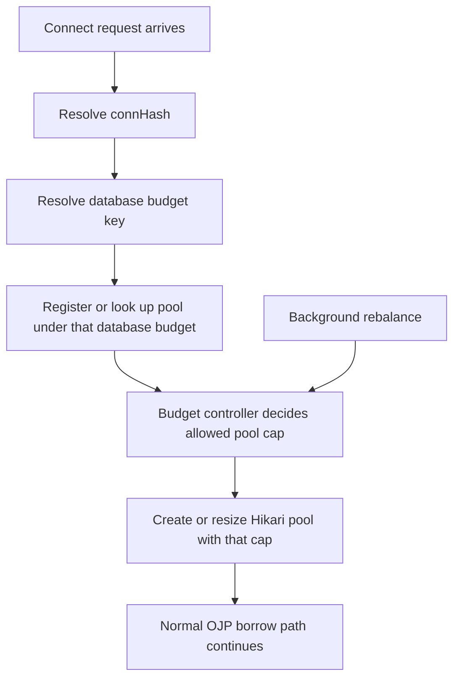
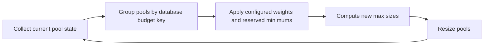
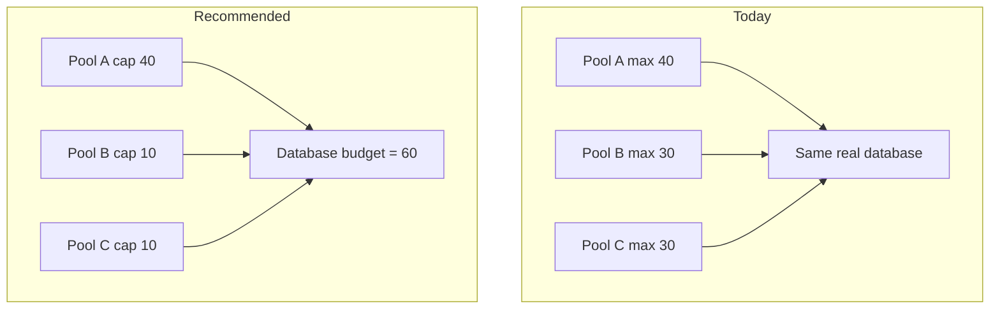

# Database Total Connection Budget Control on OJP Server

## Question

How can OJP Server guarantee that the **total number of database connections**
to one real database does not exceed a configured limit, even when OJP creates
multiple pools for that same database?

Extra constraints:

- avoid adding new queues in the hot path
- avoid adding new semaphores in the hot path
- allow higher priority for some clients
- priority may be based on **client name** or **database username**
- configuration should live on **OJP Server**

---

## Short Answer

The best direction is to control this at the **pool budget level**, not at the
**per-request borrow path**.

In simple terms:

1. group several pools under one **database budget**
2. give that budget a hard total connection limit
3. split that budget across pools using weights/priorities
4. resize pools in the background when needed
5. keep request-time behavior simple and fail-fast

This avoids putting another blocking control in front of every SQL request.

---

## What OJP Does Today

Today OJP already has strong **per-pool** controls:

- each datasource/pool gets its own `AdmissionControlManager`
- each datasource/pool gets its own `SlotManager`
- connection acquisition fails fast when the pool is exhausted
- slow-query segregation can split a pool into fast and slow lanes

But those controls are keyed per **connection hash**, not per **real database**.

Current connection hash behavior is important:

- OJP hashes together:
  - JDBC URL
  - database username
  - password
  - datasource name

So OJP can create different pools for:

- the same database with different users
- the same database with different datasource names
- the same database with different credentials

That is useful, but it also means OJP can accidentally exceed a database-wide
connection target if all of those pools grow independently.

### Simple example

- Real database safe limit: **80**
- Pool A max: **40**
- Pool B max: **30**
- Pool C max: **30**

Each pool looks valid by itself, but together they can reach **100**.

That is the gap this analysis is addressing.

---

## Why Not Add Another Hot-Path Gate?

Because that would likely repeat the same problem already observed in the past:

- more contention
- more waiting
- more tail latency
- more complexity in the hottest code path

If every `getConnection()` call has to pass through a second shared gate for
"all pools of database X", OJP would add another point of contention exactly
where performance matters most.

My opinion: **do not solve this with another request-time semaphore or queue**.

---

## Recommended Model: Database Budget Controller

Introduce a new OJP Server concept:

- **database budget key**

This key represents the **real database target being protected**.

Multiple pools may map to the same database budget key.

Each key gets one configured total budget, for example:

- `orders-prod` → max total OJP connections = **80**

Then OJP Server allocates that total budget across the pools registered under
that database key.

### Core idea

- keep current per-pool admission control
- add one **background budget allocator**
- let the allocator decide the max size of each pool
- enforce the total by controlling pool sizes, not by adding another hot-path gate

---

## High-Level Architecture



---

## How the Budget Key Should Work

This is a critical design decision.

OJP needs a stable way to say:

> "these different pools are all hitting the same real database budget"

### Possible ways to define the key

#### Option A - explicit server-side group name

Example:

- `orders-prod`
- `reporting-prod`

Pros:

- very clear
- avoids JDBC URL parsing surprises
- easiest for operators to reason about

Cons:

- needs explicit config

#### Option B - normalized JDBC target

Example:

- database type + host + port + database name

Pros:

- more automatic

Cons:

- parsing rules differ by database
- aliases, VIPs, proxies, and connection parameters may make this unreliable

#### Option C - hybrid

- explicit group name when configured
- fallback to normalized JDBC target otherwise

My opinion: **hybrid is best**, but the explicit server-side group should be the
recommended production path.

---

## Pool-Level Budgeting

Once pools are grouped under one database budget key, OJP can assign each pool
an allowed maximum.

### Example

Database budget:

- `orders-prod` total budget = **60**

Pools:

- Pool A = `app_rw`
- Pool B = `reporting_ro`
- Pool C = `etl_user`

Possible allocation:

- Pool A gets **40**
- Pool B gets **10**
- Pool C gets **10**

Then OJP creates or resizes the pools to those limits.

If Pool B is idle later, the controller may rebalance:

- Pool A = **45**
- Pool B = **5**
- Pool C = **10**

Still total = **60**

---

## Priority by Database Username

This is the cleanest first version.

Why:

- username already naturally separates pools
- username is already available at connection time
- the current connection hash already includes it

### Example

Total budget = **60**

Weights:

- `app_rw` = 4
- `reporting_ro` = 1

Allocation:

- `app_rw` gets about **48**
- `reporting_ro` gets about **12**

This is simple, understandable, and maps well to existing OJP behavior.

### My opinion

If OJP wants a first implementation with good value and lower risk,
**prioritizing by database username should come first**.

---

## Priority by Client Name

This is more complicated.

Why:

- today OJP tracks `clientUUID` for fair-share counting
- `clientUUID` is not the same as a business-level client name
- many clients may share one pool

That means one shared pool might contain:

- high-priority client traffic
- low-priority client traffic

If both are inside the same pool, pool sizing alone cannot guarantee that the
high-priority client gets better treatment.

### Two ways to support client-name priority

#### Option 1 - classify clients into separate pool classes

Example:

- `payments-service` traffic goes to one logical pool class
- `reporting-service` traffic goes to another

Pros:

- keeps fairness mostly outside the hot path
- easier to reason about

Cons:

- may increase the number of pools

#### Option 2 - keep one pool and do per-request priority admission

Pros:

- more precise fairness

Cons:

- pushes more logic into the hot path
- likely needs shared request-time coordination
- higher performance risk

### My opinion

If client-name priority is required, OJP should first treat it as a
**classification input for pool budgeting**, not as per-request scheduling.

In simple words:

> prefer "different client classes get different budgeted pool slices"
> over "every request competes in one smart global priority queue"

---

## Why Background Rebalancing Fits Better

Hikari already supports dynamic pool resizing.

That makes OJP's likely best model:

- decide caps in a background controller
- apply cap changes to the existing pools
- let normal request-time borrowing stay simple

### Rebalance loop idea



This loop can run:

- on pool creation
- on pool shutdown
- on config reload
- on a short periodic timer

This avoids doing heavy fairness decisions on every request.

---

## Suggested Allocation Rules

OJP Server could support these rules:

1. **hard total budget per database**
2. **optional reserved headroom**
3. **weights per username or client class**
4. **minimum floor per class**
5. **maximum ceiling per class**
6. **temporary borrowing of unused capacity**

### Example

- database safe limit = **100**
- reserve for non-OJP/admin usage = **20**
- OJP usable budget = **80**

Classes:

- `payments` weight 5
- `etl` weight 2
- `reporting` weight 1

Result:

- payments ≈ **50**
- etl ≈ **20**
- reporting ≈ **10**

---

## Important Tradeoff: Strictness vs Elasticity

There is a real tradeoff here.

### If OJP wants strict safety

Then:

- the sum of all pool maximums must stay within the configured database budget

That works well.

### But shrinking is not instant

If a pool is already using many active connections, reducing its configured max
does not instantly close active connections. It mainly stops future growth and
lets the pool shrink as connections become idle.

So the model is:

- strict for **configured maxima**
- eventually consistent for **live active usage during a rebalance**

This is still much better than having independent pools with no total budget.

### My opinion

This is acceptable if OJP keeps a little headroom and documents the behavior
clearly.

---

## Multi-Node Concern

This is one of the biggest concerns.

If several OJP Server nodes connect to the same database:

- each node can control its own local pools
- but local-only control does **not** guarantee the total across the cluster

### Example

- Node A budget thinks it may use **40**
- Node B budget thinks it may use **40**
- real database target is **60**

Together they can still reach **80**

### Options

#### Option 1 - static per-node split

Example:

- global target 60
- 3 nodes
- each node gets 20

Pros:

- simple

Cons:

- wastes capacity when nodes are unevenly loaded

#### Option 2 - shared distributed budget state

Pros:

- strongest cluster-wide control

Cons:

- much more complex
- introduces coordination and failure-mode questions

### My opinion

OJP should likely phase this:

1. first support **single-node/local enforcement**
2. then add **cluster-wide coordination** only if needed

---

## Suggested Server Configuration Shape

Below is an example of the kind of configuration OJP Server could expose.

```properties
# Database budget group
ojp.server.databaseBudgets.ordersProd.match.jdbcUrlPattern=jdbc:postgresql://db1:5432/orders
ojp.server.databaseBudgets.ordersProd.maxTotalConnections=80
ojp.server.databaseBudgets.ordersProd.reserveConnections=10

# Priority by database username
ojp.server.databaseBudgets.ordersProd.priorities.username.app_rw.weight=5
ojp.server.databaseBudgets.ordersProd.priorities.username.reporting_ro.weight=1
ojp.server.databaseBudgets.ordersProd.priorities.username.etl_user.weight=2

# Optional future client-class priority
ojp.server.databaseBudgets.ordersProd.priorities.clientClass.payments.weight=5
ojp.server.databaseBudgets.ordersProd.priorities.clientClass.reporting.weight=1

# Rebalancing
ojp.server.databaseBudgets.ordersProd.rebalanceIntervalMs=5000
ojp.server.databaseBudgets.ordersProd.allowBorrowing=true
```

This is only an example, not a final property naming decision.

---

## Recommended Phasing

### Phase 1 - server-side database budgeting

- add database budget key/grouping
- add hard total budget per database group
- allocate pool maxima from that budget
- support priority by **database username**
- rebalance in the background

### Phase 2 - client classification

- add optional **client name / client class** sent to OJP Server
- use it for budgeting/grouping
- prefer separate pool classes or slices over per-request priority

### Phase 3 - cluster-wide enforcement

- shared state across OJP nodes
- lease/reservation model or other coordinator

---

## What I Would Not Recommend

I would not recommend:

- adding a second global semaphore in front of every pool borrow
- adding a central queue for all pools of the same database
- making version 1 depend on per-request weighted scheduling
- using only the global server concurrency cap for this problem

Why not the global concurrency cap?

Because it protects the **OJP JVM**, not the **database connection total**.

---

## Example Comparison



---

## Concerns and Open Questions

These are the questions I think OJP should answer before implementation:

1. Does the limit need to be strict for:
   - one OJP node only, or
   - all OJP nodes combined?

2. How should OJP identify "same database"?
   - explicit server-side budget group
   - normalized JDBC target
   - both

3. What exactly is "client name"?
   - application name
   - datasource name
   - service name
   - something else

4. Is fast rejection acceptable for low-priority traffic?

5. Should unused low-priority capacity be borrowable by high-priority classes?

6. Do operators need to reserve headroom for:
   - admin sessions
   - migrations
   - non-OJP consumers

7. Is it acceptable that rebalancing is not instant for already-active connections?

---

## Final Recommendation

My recommendation is:

1. implement **database budget control on OJP Server**
2. enforce the total budget by **controlling pool sizes**
3. **do not** add another hot-path queue or semaphore
4. support **database username priority first**
5. treat **client-name priority** as a later classification/budgeting feature
6. phase cluster-wide enforcement separately

In simple language:

> Keep the borrow path fast.  
> Move the intelligence to pool sizing and background rebalancing.  
> Start with username priority because it fits the current OJP model better.

---

## Confidence

**Confidence: High (about 85%)**

Reason:

- this direction fits OJP's current per-pool architecture
- it respects the requirement to avoid extra hot-path waiting logic
- the biggest unknowns are product choices, not core feasibility

The main uncertainty is how far OJP wants to go on:

- client-name priority
- cluster-wide total enforcement

