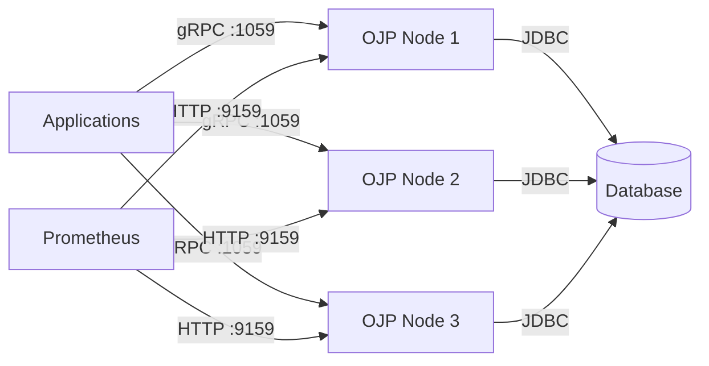

# Chapter 13a: Running OJP Server in Production

This chapter is a practical guide for production operations. It focuses on the most important decisions and checks. For full configuration details, use the deeper chapters linked throughout:

- [Chapter 3a: Kubernetes Deployment with Helm](part1-chapter3a-kubernetes-helm.md)
- [Chapter 6: Server Configuration](part2-chapter6-server-configuration.md)
- [Chapter 9: Multinode Deployment](part3-chapter9-multinode-deployment.md)
- [Chapter 11: Security & Network Architecture](part3-chapter11-security.md)
- [Chapter 13: Telemetry and Monitoring](part4-chapter13-telemetry.md)

## 13a.1 Recommended Production Architecture

Use multiple OJP Server nodes in production. A single server is a single point of failure.

A simple starting pattern is **3 OJP nodes**:

- `ojp-1`
- `ojp-2`
- `ojp-3`

Applications connect to all three nodes directly through the OJP JDBC URL (multinode format). The OJP driver handles load-aware routing, health checks, and failover on the client side, so an external load balancer is usually not required for OJP traffic.

For multinode behavior details, see [Chapter 9](part3-chapter9-multinode-deployment.md) and [Chapter 2a](part1-chapter2a-smart-load-balancing.md).

## 13a.2 Where to Deploy OJP

Keep OJP close to both the applications and the database:

- Same region whenever possible
- Low-latency network paths
- Fewer network hops

For high availability, place OJP nodes on different hosts and, where practical, across availability zones.

Simple examples:

- **Kubernetes**: one StatefulSet/Deployment with 3 replicas spread across nodes/zones
- **VMs**: three VMs on separate hosts/racks
- **Cloud compute**: three instances in the same region, distributed across AZs

## 13a.3 Server Sizing (Starting Point)

Start small, then measure:

- **CPU**: 2-4 vCPU per OJP node
- **Memory**: 4-8 GB RAM per OJP node

These are starting points only. Real sizing depends mainly on:

- Request rate and concurrency
- Query mix (short vs long-running queries)
- Number of client applications and pools
- Telemetry and logging level

Always validate with load tests that mirror production traffic. Do not treat starting numbers as fixed rules.

For deeper capacity planning, see [Chapter 22](part7-chapter22-performance-engineering.md).

## 13a.4 Networking

OJP uses two main ports:

- **gRPC port** (default `1059`) for application traffic
- **Prometheus metrics port** (default `9159`) for monitoring

Required connectivity:

1. Applications must reach OJP gRPC port
2. OJP must reach the database
3. Monitoring stack (Prometheus or equivalent) must reach metrics port

Keep OJP on private/internal networks whenever possible.

For full network and port settings, see [Chapter 6](part2-chapter6-server-configuration.md).

## 13a.5 Security

Use layered controls:

- Enable TLS, and mTLS where required
- Restrict allowed networks/IP ranges
- Keep OJP off the public Internet unless there is a strong, reviewed reason
- Protect Prometheus endpoint separately from application traffic

For complete security guidance and examples, see [Chapter 11](part3-chapter11-security.md).

## 13a.6 High Availability

Running one OJP node creates a single point of failure. Running three nodes allows continued service when one node fails.

The OJP client tracks node health and routes work to healthy nodes. For existing sessions, OJP keeps session affinity so operations for the same session continue to the same node while healthy.

Important behavior: if a node fails during an active transaction or session-bound work, those in-flight operations can fail and must be retried safely by the application.

For full failover, affinity, and migration guidance, see [Chapter 9](part3-chapter9-multinode-deployment.md).

## 13a.7 Monitoring

Use Prometheus + Grafana (or equivalent). Keep monitoring practical and action-oriented.

Watch these first:

- Request rate
- Error rate
- Latency (especially p95/p99)
- Connection pool usage and saturation
- Queue/backpressure behavior
- Circuit breaker state
- CPU and memory
- Unhealthy/recovering OJP nodes

For full telemetry configuration and metric details, see [Chapter 13](part4-chapter13-telemetry.md).

## 13a.8 Logging

Use a conservative production log level by default:

- `INFO` for normal operations
- `ERROR` when log volume must be minimized

Avoid `DEBUG`/`TRACE` in normal production operation. Enable them only for short troubleshooting windows. Send logs to a centralized platform (for example ELK/OpenSearch, Splunk, or cloud logging).

For log-level options, see [Chapter 6](part2-chapter6-server-configuration.md).

## 13a.9 Health Checks and Restarts

Use orchestrator health checks to detect unhealthy OJP instances and restart them.

In Kubernetes, configure liveness/readiness probes and restart policies (see [Chapter 3a](part1-chapter3a-kubernetes-helm.md)).

During restart/shutdown:

- Prefer graceful termination settings
- Keep transactions short
- Expect possible interruption of in-flight session-bound work

## 13a.10 Upgrades

Prefer rolling upgrades:

1. Keep multiple OJP nodes running
2. Upgrade one node at a time
3. Keep remaining nodes available for failover
4. Verify health/metrics between steps

Current limitation to plan for: during node termination, in-flight transactions/queries on that node can fail. OJP currently does not provide full connection draining for zero-loss upgrades, so applications should use safe retries and idempotent operations where possible.

See [Chapter 3a](part1-chapter3a-kubernetes-helm.md) and [Chapter 9](part3-chapter9-multinode-deployment.md) for upgrade and failover patterns.

## 13a.11 Configuration Management

Keep production configuration outside the app binary/container where practical:

- Environment variables
- Kubernetes ConfigMaps/Secrets
- Cloud parameter/secret managers
- VM-level secret injection

Operational requirement: run OJP Server with JVM timezone set to UTC (`-Duser.timezone=UTC`) to avoid timestamp conversion problems across environments. This must be a JVM argument (not just host/container timezone settings).

Practical examples:

- Direct JVM start: `java -Duser.timezone=UTC -jar ojp-server.jar`
- Containers/Kubernetes: set JVM args in the container command or `JAVA_TOOL_OPTIONS=-Duser.timezone=UTC`

Never commit passwords or private keys to source control.

For configuration hierarchy and options, see [Chapter 6](part2-chapter6-server-configuration.md).

## 13a.12 Production Checklist

Before go-live, verify:

- [ ] 3+ OJP nodes deployed
- [ ] Nodes distributed for HA (hosts/AZs)
- [ ] Private/internal networking in place
- [ ] TLS/security controls configured
- [ ] Database connectivity tested from every OJP node
- [ ] Monitoring enabled
- [ ] Centralized logs enabled
- [ ] Resource limits/requests configured
- [ ] OJP Server JVM timezone set to UTC
- [ ] Failover tested
- [ ] Rolling upgrade tested
- [ ] Load test completed

---

This chapter provided a practical production playbook. In the next chapter, we'll move to protocol internals and wire format details.
