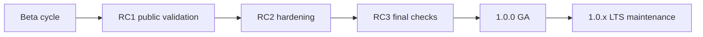

# Open J Proxy 1.0.0: Ready for Production

## A release built for real-world production use

Open J Proxy 1.0.0 is the moment the project moves from beta experimentation to a stable production baseline. This release is not a marketing milestone; it is the result of a long hardening cycle where the focus was reliability in real systems, not just adding features quickly. During the release candidate phase, users and contributors ran OJP in realistic environments, opened issues, challenged assumptions, and pushed the platform through edge cases that only show up under daily load. The GA release reflects that work directly.

## The path from beta to GA

Before 1.0.0, OJP went through a deliberate release candidate journey so production teams would not be the first line of testing. The project published RC versions, collected community feedback, fixed reported issues, and repeated validation until behavior was consistently predictable. Instead of treating RCs as optional previews, OJP used them as public checkpoints where every critical problem had to be addressed before final release.

That process matters because it changes what “1.0.0” means. In this case, it means the software was tested in public, improved in public, and only then declared stable. It also means teams adopting OJP now are starting from a version that has already absorbed practical operational feedback instead of discovering those gaps later in production.

## What was hardened before the 1.0.0 cut

A major part of the work before GA was deep JDBC behavior hardening so client applications and tools behave exactly as expected when routing through OJP. The project closed important gaps around transaction state transitions, auto-commit restoration, warning propagation, update-count correctness, SQL classification edge cases, temporal parameter handling, and failover-related behavior. These are not cosmetic details; they are the details that determine whether existing applications run cleanly without hidden regressions.

Another key area was resilience and operational correctness under pressure. Improvements to connection-level error translation, session handling, and multinode behavior reduced ambiguity during failures and made recovery paths clearer for both applications and operators. In practical terms, teams now get behavior that is easier to reason about when the environment is unstable, which is exactly when correctness matters most.

## Feature maturity achieved before 1.0

The road to 1.0.0 was not only about fixes. Several capabilities matured enough to support production deployment patterns confidently. OJP now combines driver-level load balancing and failover with stronger observability through OpenTelemetry and Prometheus-compatible metrics, allowing teams to see connection pressure, query path behavior, and system health with better clarity. The SPI-based extension model also matured, giving organizations a cleaner path to integrate custom pool strategies without forking the core platform.

At the same time, integration ergonomics improved for everyday Java teams. The Spring Boot starter and framework documentation evolved with real usage feedback, reducing adoption friction for teams that want OJP to fit into existing delivery pipelines. Testing and release practices also matured, with stronger CI discipline and clearer release automation, so quality gates are part of the default flow rather than manual heroics before each release.

## Security, stability, and release discipline

Production readiness is also about how a project responds to risk. During the pre-GA window, dependency updates, runtime updates, and release workflow adjustments were applied as part of the hardening cycle. This reduced known exposure and increased confidence that releases are reproducible and controlled. Documentation for operations, release execution, and versioning strategy was also expanded so teams can make deployment decisions with less guesswork.

Equally important, 1.0.0 starts the LTS era for the 1.0.x line. That gives production adopters a stable maintenance track focused on bug fixes and security patches, while new feature evolution continues on the main development line. For engineering leaders, this separation is essential because it supports predictable upgrade planning without forcing feature churn into critical environments.

## Why 1.0.0 is the recommended starting point now

If you tested OJP in beta, 1.0.0 is the release where that feedback has been consolidated into a stable baseline. If you are evaluating OJP for the first time, this is the version to begin with because it captures the hardening work, public validation, and issue resolution that define production trust. Open J Proxy 1.0.0 is recommended for production not because of the version number alone, but because the project did the difficult work needed to earn that recommendation.
