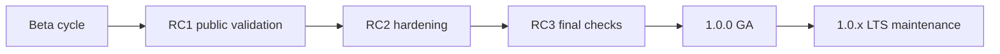

# Open J Proxy 1.0.0: Ready for Production

Open J Proxy 1.0.0 is the point where the project moves from “promising beta” to “production-ready platform.” Over the beta and release-candidate cycle, the team focused on one goal: make real deployments predictable under pressure. This release is the result of repeated public validation, broad integration testing, and fast feedback from community users who ran OJP in realistic environments before GA.

What changed most on the road to 1.0.0 was reliability in day-to-day behavior, not just feature count. The project closed the loop on the issues reported during validation and hardened core JDBC behavior, including transaction state restoration, warning propagation, update-count correctness, temporal parameter handling, failover edge cases, and connection-level error mapping. In practice, this means fewer surprises for tools and applications, cleaner error semantics, safer transitions between manual and auto-commit flows, and more stable behavior when systems are under load or recovering from faults.

At the same time, the platform matured in breadth. Before 1.0, OJP added stronger production capabilities across routing and resiliency, read/write separation support, metadata and query-path improvements, per-datasource leak detection controls, richer observability, and clearer multi-module extension points through SPI-based pool providers. The Spring Boot starter and broader framework guidance also became more complete, reducing friction for teams adopting OJP in existing Java stacks.

Security and operational readiness were treated as release requirements, not nice-to-haves. Dependency and runtime updates were applied during the release window, CI and release automation were tightened, and documentation for production operation was expanded to reflect real deployment concerns. The result is not just “version 1.0.0” as a label, but a release with stronger defaults, clearer runbooks, and a support model that now starts with long-term maintenance for the 1.0.x line.

If you evaluated OJP during beta, this is the version designed for production rollout. If you are seeing OJP for the first time, 1.0.0 is the stable baseline to start from: tested in public, hardened by real issue resolution, and recommended for production use.
